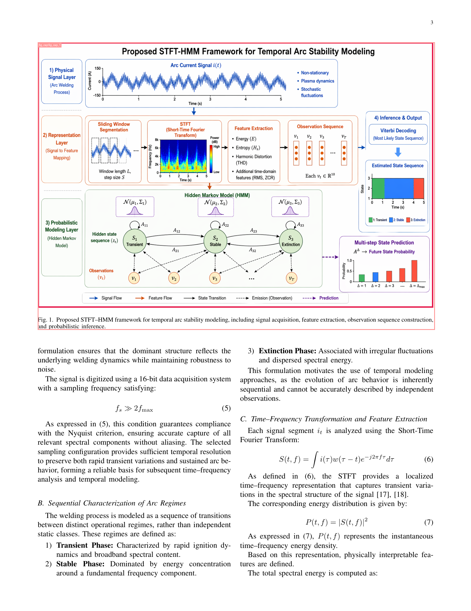
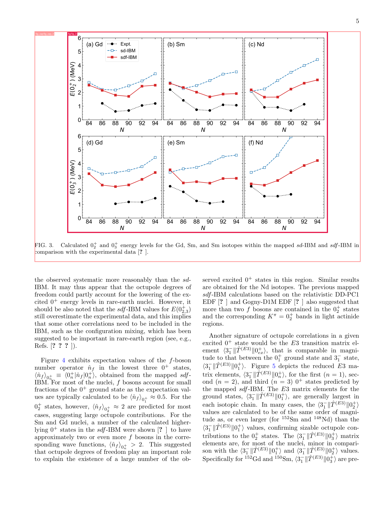
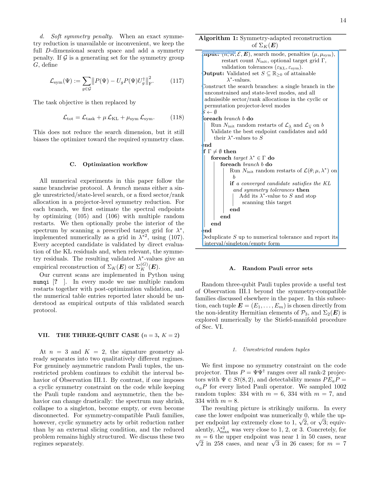

# arxiv-paper-layout-dataset

Build object-detection training data for paper-page layouts straight out of
arXiv LaTeX sources. Eight classes total — four "kinds", two projections each.
For every kind we emit a **body bbox** (per content element: one box per
`\includegraphics`, per `tabular`, per pseudocode block, per `lstlisting`)
**plus a whole-float bbox** (one box per float, covering body + caption
together as a single rectangle).

- `figure` (body) / `figure_cap` (whole float) — `\includegraphics` regions
  and the surrounding `figure` / `figure*` float that wraps body + caption.
  A 2×2 multi-subfigure float contributes 4 `figure` boxes and 1 `figure_cap`.
- `table` / `table_cap` — `tabular` grids and the surrounding `table` /
  `table*` float (multi-tabular floats contribute multiple `table` boxes).
- `algorithm` / `algorithm_cap` — the pseudocode block, and the surrounding
  `algorithm` / `algorithm2e` float covering body + title.
- `listing` / `listing_cap` — `lstlisting` code, and the enclosing `listing`
  float with its caption (when present).

The trailing `_cap` is a legacy suffix referring to "the bbox anchored at the
caption" rather than "the caption text region" — the bbox spans the entire
float (body + caption together), not just the caption text.

The pipeline doesn't rely on PDF rasterisation tricks to guess where things
are — it asks TeX directly for the coordinates, then projects them onto
PyMuPDF page-pixel space.

<p align="center">
  
  
  
</p>

## Requirements

- Linux with a full TeX Live install (`texlive-full` is enough). Tested on
  Ubuntu 24.04 with TeX Live 2023.
- `latexmk`, `biber`, `python3-pygments`, `inkscape`, `gnuplot`, `graphviz`,
  `librsvg2-bin`, `pdf2svg`, `fonts-noto`, `fonts-noto-cjk` — the classic
  arXiv-friendly set.
- Python 3.10+. Install the Python deps:

  ```bash
  pip install pymupdf pillow feedparser pandas pyarrow
  ```

## Quick start (cluster / codex agent)

One-shot setup on a fresh Linux box (`texlive-full` already installed):

```bash
git clone https://github.com/HansBug/arxiv-paper-layout-dataset.git
cd arxiv-paper-layout-dataset
pip install -r <(printf 'pymupdf\npillow\nfeedparser\npandas\npyarrow\npytest\n')

# Run the continuous crawler. Writes state / workspaces under runs/corpus/.
# Safe to Ctrl-C and re-launch -- state.json is the source of truth.
nohup python3 -u scripts/run_corpus_pipeline.py \
  --root runs/corpus \
  --max-papers 100000 \
  --max-images 1000000 \
  --candidates-per-query 25 \
  --archive-quota 10000 \
  --dashboard-every 5 \
  > runs/corpus/driver.log 2>&1 &

# Watch progress at any time without touching the driver:
python3 scripts/corpus_stats.py --state runs/corpus/state.json --top 20
tail -f runs/corpus/driver.log

# Any time -- or at the end -- turn the corpus into a YOLO dataset.
# Default is figure+table (4 classes) with full Roboflow-style layout
# + analysis plots + train_recommended.yaml + dataset_meta.json.
python3 scripts/export_yolo.py \
  --input runs/corpus/workspaces \
  --out   runs/corpus/yolo \
  --kinds figure,table --mode both \
  --neg-ratio 0.3 --workers 32
# Then:  cd runs/corpus/yolo && yolo train cfg=train_recommended.yaml
```

Skip-the-queue mode (you only want the small 51-paper seed corpus rather
than crawling fresh arXiv):

```bash
# These directories come from the texlive-arxiv-validation runs; the repo
# ships the pipeline outputs under runs/v2_validated/ and runs/v2_extra/.
python3 scripts/build_dataset.py                                       # 20 papers
python3 scripts/fetch_test_papers.py && \
python3 scripts/build_dataset.py --source-root runs/test_papers_src \
                                  --work-root runs/v2_extra            # 32 papers
python3 scripts/export_yolo.py --input runs/v2_validated runs/v2_extra \
                               --out   runs/yolo_seed
```

## Inputs

Each paper must be laid out as

```
<paper_id>/
  src/
    main.tex           # or any *.tex with \begin{document}
    figure1.pdf
    ...
  downloads/           # optional, holds the original arxiv source blob
```

The [`texlive-arxiv-validation`](https://github.com/HansBug/texlive-arxiv-validation)
validator writes exactly this layout; you can point
`--source-root` at its `runs/` folder.

## Running the pipeline

```bash
# 20 validated arXiv papers, default DPI 200
python3 scripts/build_dataset.py \
  --source-root /path/to/validated-arxiv-runs \
  --work-root   runs/v2_validated

# one paper only
python3 scripts/build_dataset.py \
  --source-root /path/to/validated-arxiv-runs \
  --papers 2604.21800v1_mathph_variance_geometry_codes
```

CLI flags:

| flag             | default                                                                    | meaning                              |
|------------------|----------------------------------------------------------------------------|--------------------------------------|
| `--source-root`  | `/home/zhangshaoang/texlive-arxiv-validation/runs/full-20260424-132920`    | directory of `<paper>/src/...` trees |
| `--work-root`    | `<repo>/runs/v2_validated`                                                           | where outputs land                   |
| `--dpi`          | `200`                                                                      | rasterisation DPI                    |
| `--limit N`      | —                                                                          | process first N papers only          |
| `--papers a b …` | —                                                                          | only process named paper directories |
| `--engine-hint`  | —                                                                          | pin the TeX engine (`pdflatex` etc.) |

## Outputs

For every paper:

```
runs/v2_validated/<paper_id>/
  src/                   # injected TeX + all compile products
  pages/page_NNN.png     # clean page rasters
  qc/page_NNN.png        # same page with labelled bboxes overlaid
  dataset/
    annotations.json     # COCO-style labels
  manifest.json          # mapping label_id -> float_id -> anchor names
```

`annotations.json` follows the MS-COCO schema (`images`, `categories`,
`annotations`), and `annotations[*].bbox` is `[x, y, w, h]` in **image
pixels** at the chosen DPI. Each annotation has an extra `label_id`
field (`fig_3`, `fig_cap_3`, `algorithm_1`, …) for debugging.

`runs/v2_validated/summary.json` aggregates per-paper success, page count, label
count and class breakdown.

## How it works (short version)

1. **Inject anchors** into every `.tex`:
   - `\alxwrap{ID}{payload}` — `\setbox` the payload, log its
     `\wd/\ht/\dp` + current `\the\hsize`, drop two `\zsavepos` anchors
     (left-baseline / right-baseline). Gives exact 2-D corners.
   - `\alxmark{ID}` — bare `\zsavepos` + typeout of the current `\hsize`.
     Bracketing this around a float body gives a Y span + an exact column
     width, no column-count heuristics needed.
2. **Compile** with the same recipe the TeX Live arxiv validator uses
   (latexmk, fall back to pdflatex/xelatex/lualatex, fall back to direct
   engine if a prebuilt `.bbl` confuses latexmk).
3. **Extract** coordinates from the generated `.aux`
   (`\zref@newlabel{name}{\posx{…}\posy{…}\abspage{…}}`). Trusting the
   `.aux` avoids the two-run TeX cycle that typeouts need.
4. **Project** sp → pt → PyMuPDF pixels; union `*_cap` with body boxes so
   it covers all `\includegraphics` inside multi-panel figures.
5. **Visualise** overlays onto the page raster so a human can sanity-check.

A longer write-up aimed at contributors / LLM agents lives in
[`AGENTS.md`](AGENTS.md).

## Testing

Tests compare a fingerprint (sorted labels + integer-pixel bboxes) of
every cached `runs/v2_validated/<paper_id>/dataset/annotations.json` against the
committed snapshot under `tests/golden/`. The pipeline itself takes
minutes per paper, so tests never re-run it — populate `runs/v2_validated/` first:

```bash
# one-time (takes a while)
python3 scripts/build_dataset.py

# then
pytest -q tests/
```

The default tolerance is 2 pixels per coordinate; override via
`ALX_BBOX_TOL=<int> pytest`. Tests `skip` a paper whose workspace hasn't
been built yet.

If a change *intentionally* improves precision, re-baseline the
affected papers:

```bash
python3 scripts/regen_golden.py --papers <paper_id>
```

### Adding more coverage (algorithm / listing cases)

Extra papers with `algorithm` / `algorithm2e` / `lstlisting` blocks can be
pulled straight from arXiv via:

```bash
python3 scripts/fetch_test_papers.py          # downloads into runs/test_papers_src
python3 scripts/build_dataset.py \
  --source-root runs/test_papers_src \
  --work-root   runs/v2_extra
ALX_RUNS_ROOT=runs/v2_extra python3 scripts/regen_golden.py
```

## Bulk-fetch arXiv metadata

`scripts/fetch_arxiv_catalog.py` queries the arXiv export API across all
top-level archives (cs / math / physics / astro-ph / cond-mat / gr-qc /
hep-* / math-ph / nlin / nucl-* / q-bio / q-fin / quant-ph / stat / eess /
econ) and saves the flattened metadata to a Parquet file. Each row
carries the paper's id, abs/pdf/source URLs, title, abstract, authors,
publication / update timestamps, primary + cross-listed categories,
comment, journal ref and DOI.

```bash
python3 scripts/fetch_arxiv_catalog.py \
  --out runs/arxiv_catalog.parquet \
  --per-archive 500
```

Rate-limited at 3s between requests per arXiv's stated policy; budget
~15 min for the full 20-archive run at `--per-archive 500`.

## Continuous corpus pipeline

`scripts/run_corpus_pipeline.py` glues arxiv fetch + pipeline +
statistics into a single crash-safe crawler. On every iteration it:

1. Reads `state.json` and computes the per-archive success counts.
2. Picks the least-covered archive (tie-broken randomly) and, within
   it, the least-covered year bucket so the crawl spreads across time.
3. Queries the arXiv export API for candidates in that bucket that
   aren't already in `state.json`.
4. Downloads the e-print, extracts, runs `process_paper`, records
   per-paper stats (pages, label counts, per-page box histogram).
5. Writes `state.json` atomically (tmp + rename) so SIGINT / OOM /
   preemption never corrupts the corpus.
6. Prints a live dashboard (same blob is persisted in the `stats`
   field of `state.json`).

Flags of interest:

| flag                      | default                | meaning                                              |
|---------------------------|------------------------|------------------------------------------------------|
| `--root`                  | `runs/corpus`          | where state, sources/, workspaces/ live              |
| `--max-papers`            | unlimited              | stop when `papers_ok` hits this                      |
| `--max-images`            | unlimited              | stop when `pages_with_labels` hits this              |
| `--archive-quota`         | unlimited              | cap per-archive successful papers                    |
| `--candidates-per-query`  | 15                     | number of arxiv hits to consider per API call        |
| `--dashboard-every`       | 1                      | print the dashboard every N papers                   |
| `--keep-workspace`        | off                    | keep raw source + compile intermediates (debug only) |

Disk footprint: after a successful paper, the pipeline keeps only
`<paper>/pages/*.png` (200 DPI PNGs) + `<paper>/dataset/annotations.json`
+ `<paper>/qc/page_NNN.png`. `src/` (raw source + compile products) and
`downloads/` are deleted. A typical paper weighs ~5-30 MB this way.

Resume: just relaunch the same command. Already-logged papers (OK or
failed) are skipped, the scheduler continues filling under-represented
archives.

Monitor without interrupting:

```bash
python3 scripts/corpus_stats.py --state runs/corpus/state.json --top 20
```

prints archive / year / primary-category / kind / boxes-per-page
histograms plus the top failure reasons (compile timeouts, absent
zref anchors, download errors, etc).

### Hot intervention via ``control.json``

The driver re-reads ``<root>/control.json`` at the top of every
scheduler step, so you can steer the crawl **without stopping or
restarting it**. A missing / malformed file is a no-op. Keys:

```json
{
  "skip_primary_cats":  ["nlin.SI", "math.AG"],
  "skip_archive_query": ["nlin"],
  "force_next_archive": "cs",
  "note": "pushing cs to unlock algorithm / listing classes"
}
```

- ``skip_primary_cats`` — candidate papers with this ``primary_category``
  are dropped before the pipeline runs. Use to blacklist sub-archives
  whose papers keep failing (e.g. pure-math floats that never emit zref
  anchors).
- ``skip_archive_query`` — archives excluded from
  ``BalancedQueryStrategy.pick``'s rotation. The scheduler otherwise
  keeps picking the least-covered archive, which won't rescue you from
  a cluster of failures all in one archive.
- ``force_next_archive`` — pins the next query's archive. Use this to
  deliberately surface underrepresented label kinds (e.g. ``cs`` for
  ``algorithm`` / ``listing``).
- ``note`` — free-form; logged once per step as ``[control] note=...``.

The driver prints ``[control] skip_cats=[...] | force=... | note=...``
at the start of every step where any of those keys are non-empty, so
the intervention is visible in ``driver.log``.

### Recommended two-monitor pattern

When an agent (or you) is steering the crawl, run **two** parallel
monitors on ``driver.log`` + ``state.json``:

1. **Fast-broadcast monitor** — short interval, one event per paper
   completion. Surfaces ``[query]`` / candidate id / ``OK|FAIL`` /
   ``kinds:`` + ``archives`` / ``cats`` lines. Purpose: immediate
   visibility, cheap to reason about.

   ```bash
   tail -n0 -F runs/corpus/driver.log \
     | grep -E --line-buffered \
         "^\[query\]|^  -> |^     OK|^     FAIL|^papers:|^kinds:|^archives |^cats |^\[control\]|^\[skip|Traceback|Error|OOM|Killed"
   ```

2. **Slow-intervention monitor** — long interval (5-15 min), emits a
   compact balance snapshot so you can decide whether to update
   ``control.json``. Purpose: rebalance label kinds / archives /
   failure clusters without human-in-the-loop at paper granularity.

   ```bash
   while sleep 600; do python3 scripts/corpus_snapshot.py; done
   ```

   ``scripts/corpus_snapshot.py`` prints one ``SNAPSHOT ...`` line per
   tick with ``papers_total`` / ``papers_ok`` / ``papers_failed`` /
   ``pages_total`` / ``pages_with_labels`` / ``total_labels`` /
   ``kinds`` / ``archives`` / ``archive_coverage=N/20`` /
   ``untouched_archives`` / ``top_cats`` / ``fail_reasons`` /
   ``fails_by_cat`` / active ``control``.

   It then prints a **3-column SUBSETS table** showing what the
   exported dataset would look like under each of three class
   policies — ``8-label`` (full), ``6-label`` (drop listing pair),
   ``4-label`` (drop listing + algorithm pairs) — after applying the
   default ``--spatial-pair`` paper-level filter. Rows:
   ``papers_pass`` / ``pages_total`` / ``pages_no_label`` (pure
   negative samples) / per-kind instance counts for each of the 8
   classes. A non-zero count in a class that's not part of a given
   subset means those instances exist in passing papers but would be
   dropped at export time under that subset — a useful cross-check.
   Pass ``--no-subsets`` to skip this block if you only want the
   one-line SNAPSHOT.

   Each tick ⇒ one event ⇒ the agent inspects label / archive /
   failure-reason balance and writes an updated
   ``<root>/control.json`` if needed. Because the driver reloads the
   file each step, interventions land on the very next paper.

   **Intervention policy for the slow monitor**:

   - **Label-kind balance**: the eight classes (``figure / figure_cap /
     table / table_cap / algorithm / algorithm_cap / listing /
     listing_cap``) should all be populated. If any are still 0 after
     a few dozen papers, ``force_next_archive`` toward an archive that
     tends to produce them (``cs`` for ``algorithm`` / ``listing``,
     ``stat`` / ``q-bio`` for tables).
   - **Domain balance**: the corpus should eventually visit every one
     of the 20 top-level arXiv archives. The snapshot's
     ``untouched_archives`` key is the authoritative list; rotate
     ``force_next_archive`` through it so coverage reaches 20/20,
     **don't rely on ``BalancedQueryStrategy`` alone** — the stock
     "least covered" rule is tie-broken randomly, so in practice one
     archive can dominate for hundreds of papers before the scheduler
     wanders to a new bucket.
   - **Failure clustering**: if a specific ``primary_category``
     accounts for the majority of failures (e.g. ``nlin.SI`` with
     ``no zref anchors in aux``, which is endemic to pure-math
     papers), add it to ``skip_primary_cats``.
   - **Clear ``force_next_archive`` after it has served its purpose**
     (usually after the targeted archive has 3-5 successful papers),
     or the driver will stay pinned there forever. Setting it back to
     ``null`` hands control back to the default scheduler.

## Export to Ultralytics YOLO format

`scripts/export_yolo.py` turns any pipeline output tree(s) — the
seed `runs/v2_validated/` + `runs/v2_extra/` or the live
`runs/corpus/workspaces/` — into a ready-to-train Ultralytics YOLO
dataset, complete with diagnostic plots, structured metadata,
integrity manifest, and a recommended training config. Images are
converted to **JPG with short-side ≤ 1024 px** by default so figure /
table boxes that occupy 5–10 % of the page are still ~50 px after
resize (healthy for YOLO small-object recall). Use `--format png` or
`--max-short-side 0` to override.

The default 8:1:1 split is **deterministic**: the sample's filename
stem embeds both `arxiv_id` and `page_id`, and its split is picked
by `sha256(stem) % 10` → 0-7 train / 8 val / 9 test. Same stem always
lands in the same split, even across re-runs or on a different host.

### Quickstart

```bash
# 100-image smoke slice (4 classes, balanced sampling, full diagnostic card)
python3 scripts/export_yolo.py \
  --input runs/corpus/workspaces \
  --out   runs/yolo_smoke \
  --kinds figure,table --mode both \
  --sample 100

# Full 4-class export with 30% negative pages (recommended for training)
python3 scripts/export_yolo.py \
  --input runs/corpus/workspaces \
  --out   runs/yolo_full_4label \
  --kinds figure,table --mode both \
  --neg-ratio 0.3 --workers 32

# 6-class export (figure + table + algorithm pairs)
python3 scripts/export_yolo.py \
  --input runs/corpus/workspaces \
  --out   runs/yolo_full_6label \
  --kinds figure,table,algorithm --mode both \
  --neg-ratio 0.3 --workers 32

# Cap-only ablation: train a "where are the float regions" detector.
# (One whole-float bbox per figure/table; covers body + caption together,
# NOT just the caption text. See --mode help below.)
python3 scripts/export_yolo.py \
  --input runs/corpus/workspaces \
  --out   runs/yolo_cap_only \
  --kinds figure,table --mode cap-only \
  --neg-ratio 0.3 --workers 32
```

### Class selection — `--kinds` × `--mode`

| flag                  | values                                | meaning                                                   |
|-----------------------|---------------------------------------|-----------------------------------------------------------|
| `--kinds`             | `figure` / `table` / `algorithm` / `listing`, comma-separated | Which kind families to include (default `figure,table`)    |
| `--mode`              | `both` / `box-only` / `cap-only`      | Which projection to emit per kind (default `both`)        |
| `--subset 4\|6\|8`    | `4` / `6` / `8`                       | Legacy shorthand: `4` = `figure,table`, `6` = `+algorithm`, `8` = `+listing`, all `mode=both`. Mutually exclusive with `--kinds`. |
| `--classes <a,b,c>`   | exact class list                      | Escape hatch — list exact class names; bypasses kinds/mode |

What `--mode` actually emits:

- **`both`** (default) — both the per-content-element body bbox AND
  the per-float whole-float bbox. A 2×2 figure with one shared caption
  contributes 4 `figure` boxes plus 1 `figure_cap` box.
- **`box-only`** — just the body bboxes. Trains a "where are the
  individual figures / tables / pseudocode bodies" detector. Multi-
  panel floats still contribute one box per panel.
- **`cap-only`** — just the **whole-float** bboxes. Despite the name,
  these are NOT caption-text bboxes — each spans the entire float
  region (body + caption together). One box per float. Useful when
  you want a "find the boundaries of every figure / table / algorithm
  block on the page" detector, sub-element granularity not required.

Spatial-pair sanity (paper-level filter) **always** uses the full
`(body, whole-float)` pair set, even in `box-only` / `cap-only` mode,
so the structural body-inside-float check is never weakened by an
output choice.

### Sampling — when you only want a slice

| flag                | default        | meaning                                                                      |
|---------------------|----------------|------------------------------------------------------------------------------|
| `--sample N`        | `0`            | Cap output to `N` images. `0` = full export.                                 |
| `--sample-strategy` | `balanced`     | `balanced` / `class-balanced` / `by-archive` / `random`                      |
| `--sample-seed`     | `0`            | RNG seed for sampling shuffles (deterministic)                               |
| `--neg-ratio`       | `null`         | Target fraction of negative pages, e.g. `0.3` → 30 % negs. Works with or without `--sample`. |

Strategies:

- **`balanced`** (default) — round-robin by archive, prefer rarer-class
  pages first. Even tiny samples surface algorithm/listing pages instead
  of being dominated by figure-only pages.
- **`class-balanced`** — assign per-class hard quotas. Use this when a
  rare class (e.g. `algorithm`) must be guaranteed in the sample.
- **`by-archive`** — pure round-robin across archives, no class bias.
- **`random`** — deterministic shuffle by `--sample-seed`.

### Quality / dedup filters

| flag                       | default   | meaning                                                                       |
|----------------------------|-----------|-------------------------------------------------------------------------------|
| `--max-pages-per-paper N`  | `30`      | Cap pages contributed by any one paper. Stops PhD theses from dominating.     |
| `--max-labels-per-paper N` | `200`     | Reject papers whose total label count exceeds this (above 99th percentile).   |
| `--min-bbox-area FRAC`     | `0.0005`  | Drop bboxes < 0.05 % of page area (artifact-tiny boxes from edge cases).      |

Pass `0` to disable any of the above.

### Paper-level filter

| flag             | meaning                                                                                              |
|------------------|------------------------------------------------------------------------------------------------------|
| `--spatial-pair` | **Default.** Every body/cap pair must be spatially valid (≥ 90 % body-in-cap; orphan rejects paper). |
| `--strict-1to1`  | Same plus `count(body) == count(cap)` per page. Smallest, cleanest subset.                           |
| `--no-filter`    | Export every paper regardless of bbox structure.                                                     |

### Performance / parallelism

| flag                 | default                    | meaning                                                                   |
|----------------------|----------------------------|---------------------------------------------------------------------------|
| `--workers N`        | `min(16, cpu_count)`       | Worker threads for candidate scan + image emit + manifest hashing. PIL releases the GIL on heavy ops, so threads scale near-linearly until I/O saturates. |
| `--symlink`          | off                        | Dev-only — symlink images instead of copying. Requires same format + no resize. |

### Negative samples

Pages with no active-class annotations land in the dataset as **pure
negatives** (empty `.txt` label) by default — YOLO uses them as
background examples to suppress false positives. Use `--skip-negatives`
to drop them entirely, or `--neg-ratio 0.3` to downsample so negatives
end up at 30 % of the final dataset (recommended for training).

### Output layout (Roboflow-style)

```
<out>/
  data.yaml                  # class names + relative split paths
  train_recommended.yaml     # ready-to-run Ultralytics training config
  dataset_meta.json          # structured metadata (provenance, stats)
  manifest.sha256            # sha256 of every emitted file
  README.md                  # auto-generated dataset card with embedded plots
  analysis/                  # diagnostic plots
    class_counts.png         # per-class label count, stacked by split
    archive_class.png        # archive × class instance heatmap
    bbox_centers.png         # bbox center heatmap per class (page-normalised)
    bbox_size.png            # bbox area / page area, per class
    bbox_aspect.png          # w/h aspect ratio, per class
    page_aspect.png          # page width/height distribution
    labels_per_image.png     # labels-per-page distribution
    preview.png              # 4×4 sample mosaic with bboxes drawn
  train/
    images/<paper_id>__page_<NNN>.jpg
    labels/<paper_id>__page_<NNN>.txt
  valid/
    images/...
    labels/...
  test/
    images/...
    labels/...
```

`data.yaml` is fully relative — `path:` is intentionally omitted, and
`train` / `val` / `test` use `../train/images` style so the dataset
directory is portable (tar/zip + ship anywhere). Each `.txt` has one
row per instance:

```
<class_index> <cx_norm> <cy_norm> <w_norm> <h_norm>
```

### Per-export disable flags

`--no-readme`, `--no-meta`, `--no-train-yaml`, `--no-manifest`,
`--no-verify` each disable one of the auto-generated artifacts. Verify
runs by default — it walks every emitted label file and checks every
row parses, every class index is in range, every coordinate is in
`[0, 1]`, and every image opens via PIL.

### Training the exported dataset

```bash
cd runs/yolo_full_4label
yolo train cfg=train_recommended.yaml
```

The config presets `imgsz=1280`, mosaic on, vertical-flip off
(caption-below relation must be preserved), and per-class weights
inverse-proportional to that export's actual class frequencies (clipped
to `[1.0, 30.0]`). Override anything via `key=value` on the CLI.

## Known limitations

- Per-subfigure caption text (`\subcaption{...}` etc.) is not emitted as
  a separate label — only the parent float's whole-float bbox
  (`figure_cap`) is, alongside one body bbox per `\includegraphics`.
  In other words: every subfigure body is labeled, but only the parent
  float-with-caption rectangle is labeled (not each subcaption).
- `minted` code blocks aren't recognised (use the `listings` package).
- Figures whose only content is a `tikzpicture` use the picture's declared
  bounding box, which may undershoot arrow heads / labels that TikZ draws
  outside that box.
- We require the paper to compile cleanly with the local TeX Live; truly
  broken arXiv uploads won't produce labels.

## License

[MIT](LICENSE).
